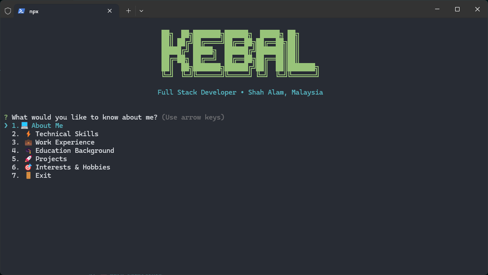

# 🚀 Kebal's Interactive Business Card

> A modern, interactive CLI business card that brings personality to your terminal!



Experience my professional profile in a unique terminal-style interface. Just one command and you'll have access to my complete portfolio, projects, and contact information - all beautifully formatted and interactive!

## ✨ Quick Start

```bash
npx kebal
```

That's it! No installation required. Just run the command and explore my interactive business card.

## 🎯 Features

- 🎨 **Beautiful ASCII Art** - Eye-catching terminal graphics
- 📱 **Interactive Menu** - Navigate through different sections seamlessly  
- 🔗 **Direct Links** - Quick access to GitHub, LinkedIn, and projects
- 📊 **Project Showcase** - Detailed information about my work
- 🌈 **Colorful Interface** - Styled with beautiful colors and formatting
- ⚡ **Lightning Fast** - Instant loading, no dependencies to install

## 🛠️ Available Commands

```bash
# Run interactive mode (default)
npx kebal

# Get JSON output
npx kebal --json

# Display help
npx kebal --help
```

## 🔧 Development

Want to contribute or run locally?

```bash
# Clone the repository
git clone https://github.com/kebalicious/npx-kebal.git

# Navigate to directory
cd npx-kebal

# Install dependencies
npm install

# Run locally
npm start
```

## 📝 What You'll Find

- 👨‍💻 **About Me** - Professional background and expertise
- 🚀 **Projects** - Detailed showcase of my work and contributions
- 📞 **Contact** - Multiple ways to connect and collaborate
- 🔗 **Social Links** - GitHub, LinkedIn, and other professional profiles

## 🌟 Why This Approach?

In a world of traditional PDFs and boring portfolios, why not stand out? This interactive terminal business card:

- ✅ Shows technical skills in action
- ✅ Provides instant access without downloads
- ✅ Works on any system with Node.js
- ✅ Memorable and unique first impression
- ✅ Easy to share with just one command

## 🚀 Powered By

- **Node.js** - Runtime environment
- **Inquirer.js** - Interactive command line interface
- **Chalk** - Terminal styling and colors
- **Boxen** - Beautiful terminal boxes
- **GitHub Actions** - Automated CI/CD pipeline

## 🤝 Connect With Me

After running `npx kebal`, you'll have direct access to all my contact information and social profiles. Let's connect and build something amazing together!

---

### 🔧 Troubleshooting

Having issues? Check out our troubleshooting guide:
[Fixing zsh: npx command not found](https://github.com/kebalicious/npx-kebal/wiki/Fixing-zsh:-npx-command-not-found)

### 📚 Inspiration

- [Studio Elsa - Write a Simple npx Business Card](https://studioelsa.se/blog/open-source-oss-npx-business-card/) by @jackboberg
- [Anmol's NPX Card](https://github.com/anmol098/npx_card) by @anmol098

---

<div align="center">

**Made with ❤️ by Kebal**

*Bringing innovation to the terminal, one command at a time*

[](https://github.com/kebalicious)
[](https://www.npmjs.com/package/kebal)

</div>
